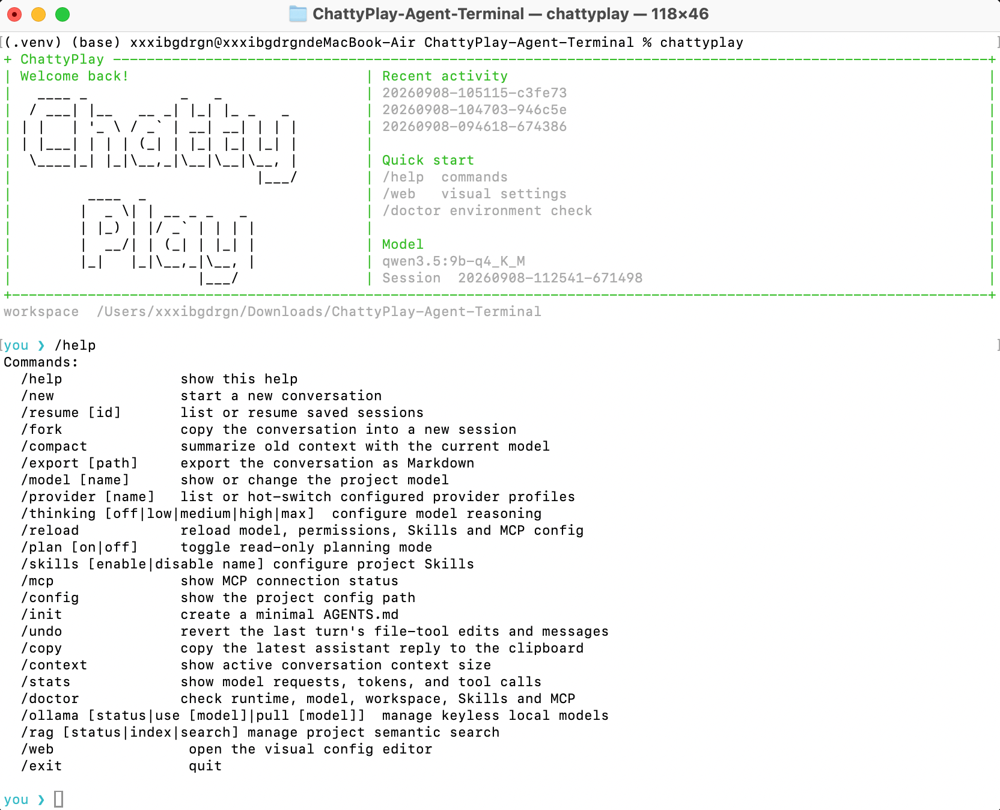
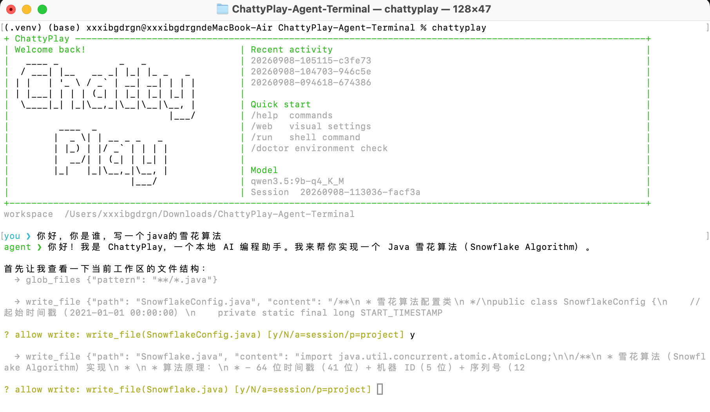

# ChattyPlay Agent Terminal

一个本地优先、跨平台的终端 AI 编程助手。支持 OpenAI 兼容协议与 Anthropic Messages API、Ollama 免 Key 本地模型、LLM Wiki 持久项目知识库、LangChain + SQLite 项目 RAG、流式工具调用、多模态图片上下文、思考模式与推理强度、原子写入与可撤销的文件编辑/移动/删除、Shell、网页与浏览器、跨平台剪贴板、Skills、MCP、计划模式、只读子 Agent 编排、Agent 追问与任务清单、会话恢复/分叉/导出/压缩、Token 统计、Provider 热切换，以及可视化配置页面。

## 效果图





## 安装

需要 Python 3.10+。macOS/Linux：

```bash
python3 -m venv .venv
source .venv/bin/activate
python -m pip install -e .
export OPENAI_API_KEY="sk-..."
```

Windows PowerShell：

```powershell
py -m venv .venv
.\.venv\Scripts\Activate.ps1
python -m pip install -e .
$env:OPENAI_API_KEY="sk-..."
```

模型默认为 OpenAI 兼容接口。运行 `chattyplay --web` 打开配置页面，设置 Base URL、模型名和 API Key 的环境变量名。密钥不会写入配置文件。

推荐本地方案（M 系列 16GB 机器适用）：先安装并启动 [Ollama](https://ollama.com/download)，然后运行：

```bash
ollama serve                         # 或 macOS: brew services start ollama
chattyplay --setup-local             # 拉取 Qwen3.5 9B Q4 + EmbeddingGemma 并切换
```

此配置无需 API Key。其他 Ollama、LM Studio 等无需鉴权的 OpenAI 兼容服务，也可将 `api_key_env` 设为空字符串。

## 使用

```bash
chattyplay                         # 交互终端
chattyplay "检查项目并修复测试"     # 单次任务
chattyplay -C path/to/project      # 指定工作区
chattyplay --resume SESSION_ID     # 恢复会话
chattyplay --web                   # 可视化配置
chattyplay --doctor                # 检查运行环境与配置
chattyplay --setup-local           # 部署并选择推荐 Ollama 模型
```

直接运行 `chattyplay` 会在当前 macOS/Windows 终端中显示响应式 ChattyPlay ASCII 欢迎页并进入交互界面；宽终端显示双栏最近会话与快捷入口，窄终端自动切换单栏。`chattyplay --web` 才会打开仅监听本机的可视化配置页。

终端支持带耗时与中断提示的首字前 loading、逐段流式回复、历史记录、命令补全、`Ctrl+J` 多行输入、`Shift+Tab` 切换计划模式，以及 `@relative/path` 文本或图片引用（PNG/JPEG/GIF/WebP，视觉模型可直接理解）。同一会话的每次请求都会携带 `agent.max_context_chars` 预算内的完整历史轮次；默认在达到该预算的 80% 时自动总结较旧轮次并保留最近轮次，失败时会无感回退到原有裁剪逻辑。可用 `agent.auto_compact` 关闭，或通过 `agent.auto_compact_ratio`（0.5–1）调整触发点；`/compact` 可随时手动压缩完整会话。会话会自动保存，可用 `/resume` 或 `--resume` 跨进程继续。本地 Ollama 默认显式关闭长思考并限制历史上下文以降低首字延迟；复杂任务可用 `/thinking low|medium|high` 临时提高推理强度，再用 `/thinking off` 恢复快速模式。运行 `/help` 可查看全部命令；`/run <命令>` 可在现有权限与安全规则保护下直接运行测试、构建或 Git 命令，`/wiki build` 用当前模型编译可持续更新的项目 Wiki，`/wiki status` 检查是否过期，`/wiki show` 查看内容；RAG 继续用于精确源码检索。`/reload` 热重载配置，`/copy` 复制最近回复，`/skills enable 名称` 启用技能，`/ollama use [模型]` 切换免 Key 本地模型，`/ollama pull [模型]` 拉取指定模型，`/rag index` 建立项目语义索引，`/rag search 问题` 可直接检索。文件工具在 macOS 和 Windows 上均使用同目录临时文件原子替换，覆盖时可校验 `read_file` 返回的 SHA-256，并跳过内容未变化的重复写入。源码变更后索引与 Wiki 会标记为过期并要求重建。Agent 获得 `search_codebase` 与 `read_project_wiki` 工具。根目录 `AGENTS.md` 会作为项目指令载入。

写文件、Shell、浏览器、剪贴板和 MCP 默认逐次确认：输入 `a` 对当前进程放行，输入 `p` 写入项目配置并长期放行；`-y` 仅适合可信任务。

## 配置

项目配置位于 `.chattyplay/config.json`，覆盖用户级 `~/.chattyplay/config.json`。示例：

```json
{
  "provider": {
    "api_style": "openai",
    "base_url": "https://api.deepseek.com/v1",
    "api_key_env": "DEEPSEEK_API_KEY",
    "model": "deepseek-chat"
  },
  "skills": { "enabled": ["coder"] },
  "providerProfiles": {
    "local": {
      "base_url": "http://127.0.0.1:11434/v1",
      "api_key_env": "",
      "model": "qwen3.5:9b-q4_K_M"
    }
  },
  "rag": {
    "enabled": true,
    "base_url": "http://127.0.0.1:11434",
    "embedding_model": "embeddinggemma",
    "top_k": 6,
    "chunk_lines": 80,
    "overlap_lines": 10
  },
  "mcpServers": {
    "filesystem": {
      "command": "npx",
      "args": ["-y", "@modelcontextprotocol/server-filesystem", "."]
    }
  }
}
```

Anthropic 原生接口使用如下配置：

```json
{
  "provider": {
    "api_style": "anthropic",
    "base_url": "https://api.anthropic.com/v1",
    "api_key_env": "ANTHROPIC_API_KEY",
    "model": "claude-sonnet-4-5"
  }
}
```

Skills 按项目优先级从 `.chattyplay/skills/*/SKILL.md`、`.agents/skills/*/SKILL.md`、用户同名目录发现。MCP 使用标准 stdio JSON-RPC，远端工具会注册为 `mcp__服务器__工具`。

配置 Playwright MCP 后，Agent 可以读取页面、点击、填写表单和截图：

```json
{
  "mcpServers": {
    "playwright": { "command": "npx", "args": ["@playwright/mcp@latest"] }
  }
}
```

## 安全边界

- 文件工具解析真实路径并限制在当前工作区，包含软链接越界防护。
- 高副作用工具按 `allow / ask / deny` 配置；常见系统级破坏命令还有额外阻止。Shell 获准后等同当前用户权限，请仅批准可信命令。
- 配置服务只监听 `127.0.0.1`，写操作还需要每次启动随机生成的页面令牌。
- Shell 本身能力很强；批准命令前仍应阅读终端展示的命令预览。

## 验证

```bash
python -m unittest discover -s tests -v
python -m compileall -q chattyplay
```

## 赞助

如果你认为我的项目对你很有帮助，而且情况允许的话，那么请考虑支持我的项目。我将非常感激任何的支持，哪怕只是一点点的资助，也能激励我持续开发和改进这个项目。

您可以通过以下几种方式支持我的项目：

- 赞助我：您可以通过贡献资金来支持我的项目，这将帮助我支付服务器、工具和其他开发成本。您可以在下方找到资助方式。

- 分享项目：如果您不能贡献资金，但是您认为我的项目非常有价值，那么请考虑分享项目链接给您的朋友和同事。这将有助于我的项目得到更多的关注和支持。如果可以请给一个小小的star！

- 提供反馈：您可以通过提交Issues或者Pull Requests来帮助改进我的项目。如果您发现了任何错误或者您认为我的项目可以改进的地方，欢迎随时向我提供反馈。

总之，非常感谢您对我的项目的支持，我将努力不懈地改进和提高这个项目的质量，让它更好地为您和其他用户服务。

<br />

联系我（WeChat：Dveiklokk）：


WeChat Pay：


